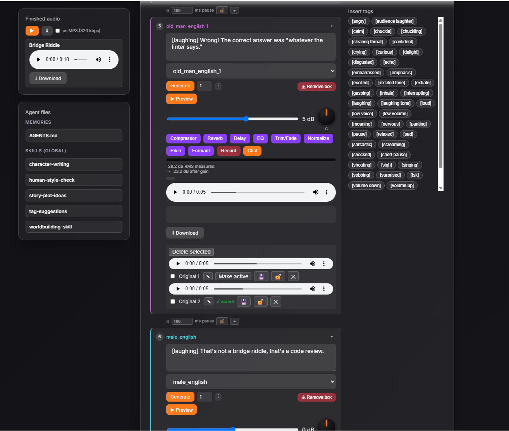
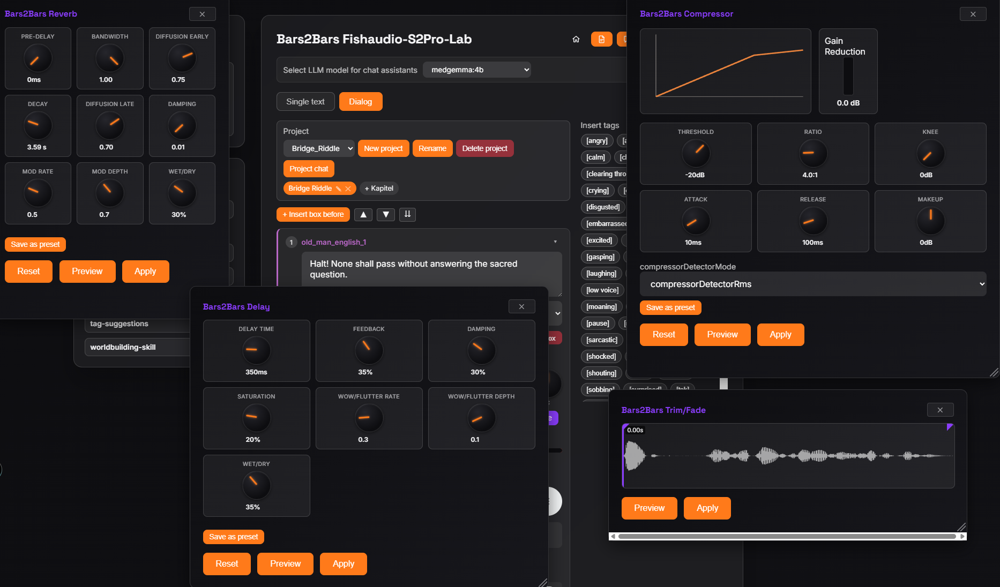
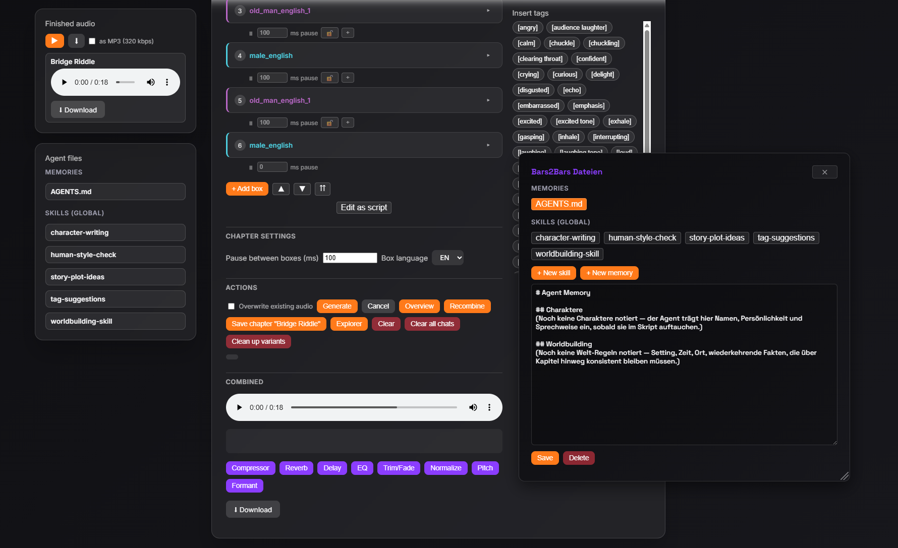
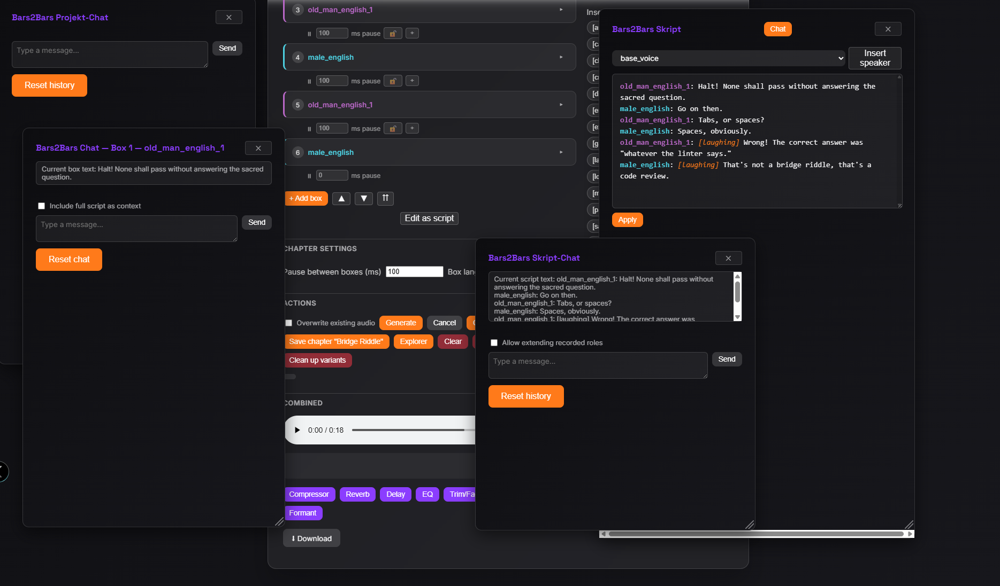

# Voice Agent Audiobook Lab

A full-stack, local text-to-speech lab: a multi-speaker dialog builder, 9 real-time audio effects (compressor, reverb, delay, EQ, pitch/formant shift — custom DSP, not just library wrappers) with 0 ms-latency live previews, 3 LangChain chat assistants with persistent per-project memory and reusable skills, and a native Tauri desktop app — all wrapped around a local voice-cloning model. See [Screenshots](#screenshots) below.

> **License note:** this is a full lab built around [`fishaudio/s2-pro`](https://huggingface.co/fishaudio/s2-pro), and the **model weights are not free to use commercially** — non-commercial use only under the Fish Audio Research License; commercial use needs a separate license from Fish Audio (contact business@fish.audio). See [License note](#license-note) below for the full detail. Want a fully free/open model instead? Look at alternatives like [VoxCPM](https://github.com/OpenBMB/VoxCPM) or [MOSS-TTSD](https://github.com/OpenMOSS/MOSS-TTSD) and swap the engine — everything past `engine_client.py` (the orchestrator, effects, UI) is model-agnostic as long as the replacement exposes a similar HTTP interface.

This is a personal lab, not a finished product — built to experiment with running `s2-pro` locally and explore what a small audiobook/dialogue tool could look like around it.

## Architecture

Two processes:

- **Engine** (`src/engine/`): a native C++ inference server built from [`s2.cpp`](https://github.com/rodrigomatta/s2.cpp) (community fork, GGUF-quantized weights, CUDA backend). Exposes a single `POST /generate` endpoint. Handles only one request at a time.
- **Orchestrator** (`src/orchestrator/`): a minimal FastAPI app that serves a browser UI and proxies requests to the engine, adding CORS headers the engine itself doesn't send. `GET /` serves an animated landing page (portfolio pitch, CSS-only, skippable via a `localStorage` flag); the actual tool now lives at `GET /app`. Endpoints: `GET /voices`, `GET /voices/detail` (detail list including lock status), `POST /voices` (create a new reference voice), `DELETE /voices/{name}` (delete a voice), `GET /voices/{name}/usage` (scan voice usage across all projects/chapters), `PUT /voices/{name}/lock` (lock/unlock a voice), `PUT /voices/{name}/rename` (rename a voice and update all chapter references), `GET /voices/{voice}/preview` (reference-audio preview without a full generation), `GET /tags` (the fixed `[tag]` vocabulary, single source of truth for both the frontend's tag panel and the chat assistant's system prompt), `POST /generate` (proxy to the engine), `POST /combine` (concatenates several generated WAV clips into one file, with a per-transition silence gap and per-clip volume gain; automatically upmixes mono clips to stereo if the set includes at least one stereo clip, so mixed mono/reverbed chapters can still be combined), `POST /language/{lang}` (persists the UI language choice as a cookie), a family of `/skills-files/...` routes to view, edit, and delete agent memory (`AGENTS.md`) and skill files (`<skill>/SKILL.md`) in a dedicated global overlay, and a family of `/projects/...` routes for named, multi-chapter dialog projects saved server-side: project/chapter CRUD, chapter reordering and renaming, per-box audio and combined-chapter audio, a ZIP download of every chapter's combined audio, per-box audio variants, chapter-level combined audio variants (`POST/GET/DELETE/PUT .../combined-variants/...`), dynamics compressor endpoints (`POST .../compress/preview` and `POST .../compress/apply`), Dattorro plate reverb endpoints (`POST .../reverb/preview` and `POST .../reverb/apply`), 9-band graphic EQ endpoints (`POST .../eq/preview` and `POST .../eq/apply`), a clip-trim endpoint (`POST .../trim/apply`, no preview route — trim preview is entirely client-side), and a per-box streaming chat endpoint (`POST .../boxes/{box_index}/chat`, Server-Sent Events) backed by a local LangChain + Ollama agent — all four audio effects available for both box and combined scope; chat is box-level only. See `Docs/frontend-specification.md` for the exact route table and payload shapes.

```
Browser  →  Orchestrator (FastAPI, :8000)  →  Engine (s2.cpp, :3030)
```

## Screenshots

**Dialog tab** — multi-speaker scene with boxes, tag panel, and the agent-files sidebar:



**Audio effect overlays** — Reverb, Compressor, Delay, and Trim/Fade open at once, each with live-updating knobs:



**Chapter actions and the Bars2Bars Dateien overlay** — combined-audio controls plus per-project memories/skills:



**The three chat assistants** — Projekt-Chat, box-level chat, and the script editor with its own Skript-Chat:



## Web UI

Two tabs: **Einzeltext** for single-text generation, and **Dialog** for multi-speaker scenes — add as many text+voice boxes as needed, generate them in sequence (the engine only handles one request at a time, queued client-side), then combine them into a single WAV. Boxes can be inserted before, after, or between existing ones, and collapsed individually or all at once. Each transition between boxes can have its own pause length; a global field can also set all of them at once. Each box also has its own volume slider (dB, with live preview, a measured-loudness readout, and a live level meter) so different reference voices can be balanced against each other before combining, plus a round pan knob (-100 left to +100 right, center 0, double-click to reset) right next to it — live playback goes through a client-side `StereoPannerNode`, no round-trip needed for that, but the same value is also sent along whenever the chapter gets (re)combined, where the server bakes in the identical equal-power pan gain (`_apply_pan` in `src/orchestrator/audio/combine.py`) so it's actually present in the exported audio, not just the live preview; no audio variant is produced either way, and it's deliberately **box-only** with no combined-audio equivalent — and its own speaker-accent color (deterministic per voice name, a 12-color palette) used consistently across boxes and the overview. A box can generate 1-5 audio variants per click, list them for comparison, and switch which one is active; a cleanup action prunes the inactive ones from the server. Both tabs share a clickable emotion-tag panel (`[laughing]`, `[whisper]`, etc.) that inserts tags at the cursor position.

**Tip:** `[tags]` don't land the same way every time — generate 3-5 variants for a heavily-tagged line rather than one, then pick whichever take actually delivers the emotion right.

A **script mode** offers an alternative way to write a scene, opened as its own Bars2Bars-style overlay (draggable, Escape-to-close, same modal chrome as the effect overlays below): a single `Sprecher: Text`-per-line textarea (pre-filled from the current boxes) with a live syntax-highlighting overlay (speaker names colored per their accent, `[tags]` picked out in italic) and a speaker dropdown that inserts a new line at the cursor. Applying the script maps line N onto box N — updating text/voice on existing boxes without touching their audio, appending new boxes for extra lines, and removing (with confirmation, if they still hold audio) any boxes beyond the last line.

The Dialog tab also supports named, multi-chapter **projects** saved server-side (`data/dialog_projects/`) so longer work can be picked back up across sessions, and a read-only **overview panel** that shows the whole dialog as a continuous, speaker-labeled script that updates live while typing. Chapters can be reordered within a project via drag-and-drop and renamed in place. Generated audio is saved per chapter alongside the text, so reopening a saved chapter restores every box's audio without regenerating; individual boxes can be regenerated on their own, and a separate **recombine** action merges the current clips into one file without redoing the rest. A separate **explorer panel** ("Dateibrowser") lists every chapter's finished, combined audio for quick playback and download, independent of which chapter is currently open, plus a one-click ZIP download of every chapter's combined audio in a project. Combined audio also supports a chapter-level variants system (`combined_variants/`), allowing non-destructive comparison of full-chapter candidate renders.

Eight audio effect overlays are available on individual dialog boxes and on combined chapter audio, sharing a common "Bars2Bars" look (violet-titled header) and the same Vorhören/Anwenden flow — applying persists the output as a new audio variant (e.g. `..._compressed.wav`, `..._reverb.wav`, `..._delay.wav`, `..._eq.wav`, `..._trimmed.wav`, `..._normalized.wav`, `..._pitch_shifted.wav`, `..._formant_shifted.wav`) rather than overwriting existing files:

- **Bars2Bars Compressor** (`compress_pcm16` in `src/orchestrator/audio/compressor.py`): feed-forward dynamics processing (threshold, ratio, soft-knee, attack/release envelope follower, peak/RMS detection, and makeup gain), 6 rotary knobs, an interactive SVG transfer-curve graph, a real-time Web Audio API (custom `ScriptProcessorNode` reimplementing the exact server-side algorithm) preview with 0 ms parameter latency, and a dynamic gain-reduction meter animated against playback. A reset button restores the fixed defaults. Settings applied to a box or combined audio are remembered (`compressor_params`/`combined_compressor_params` in the chapter manifest) and pre-fill the overlay the next time it's opened.
- **Bars2Bars Reverb** (`apply_reverb_pcm16` in `src/orchestrator/audio/reverb.py`): an offline port of the classic Dattorro plate reverb (1997), verified against the public-domain `khoin/DattorroReverbNode` reference; the 12-delay-line tank recurrence is JIT-compiled via `numba` (`@njit(cache=True)`) rather than run as a plain Python loop, cutting a 30s clip's processing time from ~21s to well under a second after the one-time warm-up compile. 9 rotary knobs (Pre-Delay, Bandwidth, Diffusion Early/Late, Decay in seconds, Damping, Mod Rate/Depth, Wet/Dry %); always outputs stereo, and the output is automatically extended with an estimated silence tail so the decay doesn't get cut off at the original clip's length. Settings persist the same way as the compressor's (`reverb_params`/`combined_reverb_params`). Like the compressor, "Vorhören" now runs through a live, bit-exact JS reimplementation of the same tank (verified sample-for-sample against the server-side algorithm) instead of a server round-trip per knob change.
- **Bars2Bars Delay** (`apply_delay_pcm16` in `src/orchestrator/audio/delay.py`): a tape-style delay — feedback delay line with LFO-modulated cubic-interpolated read (wow/flutter), one-pole lowpass damping, and `tanh` saturation in the feedback path; preserves the input's channel count. 7 rotary knobs (Delay Time in ms, Feedback, Damping, Saturation, Wow/Flutter Rate & Depth, Wet/Dry %), and the output is automatically extended with an estimated silence tail so feedback repeats don't get cut off at the original clip's length. Settings persist the same way as the other effects (`delay_params`/`combined_delay_params`). "Vorhören" runs through a live Web Audio API preview (custom `ScriptProcessorNode` reimplementing the same cubic-interpolation/wow-flutter/damping/saturation algorithm) with 0 ms parameter latency, same pattern as Compressor/Reverb.
- **Bars2Bars EQ** (`apply_eq_pcm16` in `src/orchestrator/audio/eq.py`): a 10-band graphic EQ — cascaded peaking biquad filters at fixed ISO frequencies (31 Hz–16 kHz), per the RBJ Audio EQ Cookbook (the same formula Web Audio's native `BiquadFilterNode` implements). 10 vertical sliders (not knobs), one gain control per band. Live "Vorhören" preview uses the browser's *native* `BiquadFilterNode` chain directly — unlike Compressor/Reverb, no custom JS DSP port was needed, so there's no `ScriptProcessorNode` main-thread glitching risk for this effect. The TTS engine's real output framerate is 44100 Hz (not the previously-assumed 24000 Hz), whose Nyquist frequency comfortably covers the full 10-band ISO range; a runtime guard still rejects any band at or above Nyquist, protecting lower framerates (e.g. 24000 Hz reference/clone audio). Settings persist the same way as the other effects (`eq_params`/`combined_eq_params`).
- **Bars2Bars Trim**: lets the user drag start/end markers over a static waveform to cut a clip down to that range — general-purpose, not tied to any other effect. Decodes the clip once client-side and previews the selected range directly via `AudioBufferSourceNode`, with no server round-trip and no settings persistence (trimming is a one-off edit, not a re-adjustable parameter set).
- **Bars2Bars Normalize** (`normalize_pcm16` in `src/orchestrator/audio/normalize.py`): raises or lowers a clip's level to a target, switchable between three measurement modes — Peak, RMS, or LUFS (integrated loudness per ITU-R BS.1770, via `pyloudnorm` — the app's first external DSP dependency; Peak/RMS stay pure standard library like the other effects). No knobs — just a mode dropdown and a target-value field, since normalization is a single whole-clip measurement and gain factor, not a continuously adjustable curve; "Vorhören" always round-trips to the server (no client-side live preview). Settings persist the same way as the other effects (`normalize_params`/`combined_normalize_params`).
- **Bars2Bars Pitch** (`pitch_shift_pcm16` in `src/orchestrator/audio/pitch.py`): shifts a clip's pitch in semitones (-12 to 12) and cents (-50 to 50) without changing playback speed, via `librosa` (the app's second external DSP dependency after `pyloudnorm`) for the server-side "Anwenden" render. "Vorhören" runs through a live JS phase-vocoder port instead (`static/js/dsp/pitch-shifter.js`, based on Stephan M. Bernsee's classic FFT phase-vocoder algorithm) via `AudioContext` + `ScriptProcessorNode`, no server round-trip per parameter change. Settings persist the same way as the other effects (`pitch_params`/`combined_pitch_params`).
- **Bars2Bars Formant** (`formant_shift_pcm16` in `src/orchestrator/audio/formant.py`): shifts a clip's timbre/vocal-tract resonances in semitones (-12 to 12) and cents (-50 to 50) *without* changing pitch — the counterpart to Pitch, via `pyworld` (a WORLD-vocoder wrapper, the app's third external DSP dependency) for the server-side "Anwenden" render. Chosen over a `librosa`-based hand-rolled formant warp after `librosa`'s own docs turned out to describe its phase-vocoder pitch-shift as artifact-prone for speech; WORLD's F0/spectral-envelope/aperiodicity decomposition is purpose-built for this. "Vorhören" runs through a live JS LPC envelope-warping port instead (`static/js/dsp/formant-shifter.js`), same `AudioContext`/`ScriptProcessorNode` approach as Pitch, no server round-trip per parameter change. Settings persist the same way as the other effects (`formant_params`/`combined_formant_params`).

A ninth overlay, **Bars2Bars Chat**, is available per dialog box (not for combined audio): a streaming chat assistant (LangChain `create_agent` + a local `ChatOllama` model) that helps rewrite, shorten, or improve that box's text. Replies stream in token-by-token over Server-Sent Events; any assistant reply can be applied straight into the box with one click. The assistant knows the app's `[tag]` vocabulary and is instructed to reply with nothing but the revised box text (so "In Box übernehmen" is always safe to click), but may ask a single clarifying question first if the request is ambiguous. Chat history is never persisted to the chapter manifest, but is mirrored to the browser's `localStorage` per project+chapter, so it survives page reloads and switching between chapters/projects (until explicitly cleared via the box's own "Chat zurücksetzen" or the global "Alle Chats leeren" button).

The **script editor** (see above) has its own chat assistant too, **Bars2Bars Skript-Chat**, opened via a "Chat" button in its overlay header. It's a separate agent (`src/orchestrator/agents/script_chat_agent.py`) operating on the whole script text at once instead of a single box, and — unlike the box chat — it's wired up with LangChain `deepagents`' skills middleware (`FilesystemMiddleware` + `SkillsMiddleware`, backed by `FilesystemBackend` — see [Security note: chat agent file access](#security-note-chat-agent-file-access) below), loading every `SKILL.md` under `src/orchestrator/skills/` at startup so the assistant can be handed reusable, markdown-defined capabilities. Ships with five skills so far: `tag-suggestions` (suggests `[tags]` from the fixed vocabulary at unambiguous emotional points in the script, without rewording the dialogue itself), `human-style-check` (flags AI-sounding phrasing in the script text), `story-plot-ideas` (helps brainstorm non-obvious continuations/plot twists), `worldbuilding-skill` (structures a project's setting — geography, society, rules — always into its own `Welt.md`, with only a pointer left in `AGENTS.md`), and `character-writing` (structures characters via the GMC model — Goal/Motivation/Conflict). Its history persists separately from box chats (`fishaudio_script_chat_history` in `localStorage`) with its own reset button, deliberately not tied to the global "Alle Chats leeren" button.

A third chat assistant, **Bars2Bars Projekt-Chat** (`src/orchestrator/agents/project_chat_agent.py`), is project-scoped rather than tied to a single box or script — opened via a header icon button or a text button in the project panel. Its purpose is onboarding: a free-form conversation about the project's story, characters, and world that the agent turns into persistent notes on its own, writing directly into `AGENTS.md` and/or new topic-specific `.md` files (e.g. `Charaktere.md`) inside the project folder — see [Security note: chat agent file access](#security-note-chat-agent-file-access) for the broader filesystem access this implies compared to the other two chats. History persists per project in `localStorage` (`fishaudio_project_chat_history`), independent of any chapter.

A **DE/EN toggle** in the header switches every UI string between German (default) and English; the choice is stored server-side as a cookie, per browser.

See `Docs/frontend-specification.md` for a full technical spec of the data models, API routes, and client-side state management — written as a reference for rebuilding or migrating the frontend.

## Voices

Reference voices for cloning live in `data/audio_data/voices/` as `<name>.wav` + `<name>.txt` (transcript) pairs — a voice only shows up in the web UI's selector once both files exist. Each voice can be previewed (its raw reference audio) directly in the UI before generating anything.

Reference voices in `data/audio_data/voices/` were synthesized with [`Qwen/Qwen3-TTS-12Hz-1.7B-Base`](https://huggingface.co/Qwen/Qwen3-TTS-12Hz-1.7B-Base) (Apache 2.0 — free for commercial use, no restrictions beyond standard Apache 2.0 terms), not real recordings.

Voices can be created directly from any generated box variant or microphone recording in the UI (Plan 105). A dedicated **Voices Management Overlay** (`#voices-btn` in the header) allows listing all reference voices, toggling a per-voice lock (🔒/🔓) to protect voices from accidental deletion or renaming, renaming voices (which automatically updates all matching box voice references across all saved projects and chapters), and deleting voices with a safety usage check (shows where the voice is still assigned before confirming deletion, Plan 106).

**Tip:** voices are shared globally across every project, not scoped to one — renaming immediately updates all of them, with no separate warning (unlike deleting, which shows exactly where a voice is still used before you confirm). To try a variation without touching a shared voice everyone else's projects depend on, generate fresh audio from the base voice (or an existing one, tags included) and save the result as a new voice instead of renaming — that way you always have a clean, untouched starting point to branch new voices from.

Every voice `<select>` also always offers a **"none (base voice)"** option (value `""`, hardcoded in the frontend, not one of the files above) — generation without any reference audio. This is **not a consistent voice**: without a reference to clone, the engine picks a different-sounding voice on every single generation. Fine for quick throwaway tests, not for anything where the speaker needs to sound the same across takes — save the result as a real voice first if you want to reuse it.

## Requirements

- NVIDIA GPU with CUDA 12.4+ (tested on a 16 GB card; `q8_0` quantization fits with headroom)
- Python 3.12, [uv](https://github.com/astral-sh/uv)
- A built `s2.cpp` binary and a GGUF model variant (not included in this repo — see [Model variants](https://github.com/rodrigomatta/s2.cpp#model-variants))
- `python-multipart` (installed via `uv sync`; needed by FastAPI to parse the file uploads for `/combine`)
- [Ollama](https://ollama.com/) running locally with the `gemma4:12b` model pulled (`ollama pull gemma4:12b`) OR an `NVIDIA_API_KEY` set in your environment — used for the Bars2Bars Chat assistants (box-level and script-level); the rest of the app works fine without them. A header dropdown lets you switch between local Ollama and live-verified NVIDIA AI Endpoints models on demand. For Ollama, the model name is configurable via the `OLLAMA_MODEL` variable in `.env` (defaults to `gemma4:12b`).
- [LangSmith](https://smith.langchain.com/) account (optional, free tier) — for tracing/debugging the three LangChain chat agents (box, script, project). Set `LANGSMITH_API_KEY`/`LANGSMITH_TRACING`/`LANGSMITH_PROJECT` in `.env` (see `.env.example`); the app runs fine without it, tracing is just off.

## Running it

Windows: double-click `start.bat` — it opens the engine and the orchestrator each in their own console window.

Manually:

```bash
# 1. Start the engine (from src/engine/, once the binary + model are in place)
./s2.exe --server --host 0.0.0.0 --port 3030 -c 0 -m s2-pro-q8_0.gguf -t tokenizer.json --no-vram-swap

# 2. Start the orchestrator (from the project root)
uv run uvicorn src.orchestrator.main:app --host 0.0.0.0 --port 8000
```

Open `http://127.0.0.1:8000/` — a short animated landing page introduces the project; click through to `/app` for the actual tool (or check "Nicht mehr anzeigen" to skip straight to `/app` on future visits, reversible via the "Startseite" link in the tool's header).

`--no-vram-swap` is required: without it, the engine's hot-swap mechanism crashes on the second request. (An alternative vLLM-based setup path was tried first and abandoned for this reason.)

## Desktop App (Tauri, prototype)

`src-tauri/` wraps the web app in a native Windows window and starts the engine and orchestrator itself — no `start.bat`, no browser. It's a prototype, not a signed installer.

**Requirements (in addition to the ones above):**
- Rust toolchain (`cargo`)
- Node.js + npm

**Build steps:**

```bash
# 1. Engine: build/obtain s2.exe + its DLLs (see Requirements above),
#    place them together with the GGUF model and tokenizer.json in src/engine/

# 2. Orchestrator: bundle it as a standalone onedir build
uv run pyinstaller orchestrator.spec
# -> creates dist/orchestrator/

# 3. Tauri CLI
npm install

# 4. Build the app (bundle.resources in tauri.conf.json copies
#    src/engine/ and dist/orchestrator/ into the build output automatically)
cd src-tauri
cargo build --release
```

The finished app is at `src-tauri/target/release/app.exe` (binary name from `[package] name` in `src-tauri/Cargo.toml`). For a quick debug run instead of a release build, use `cargo run` from `src-tauri/`.

## Security note: chat agent file access

Three chat assistants (box-level, script-level, and project-level — see
[Web UI](#web-ui)) use LangChain `deepagents`' `FilesystemMiddleware`/
`MemoryMiddleware`/`SkillsMiddleware`. As of 2026-08-11, all three share the
same backend shape: a `CompositeBackend` (`deepagents.backends`) whose
`default` route is the current project's own directory
(`data/dialog_projects/<project>/`) and whose `/skills/` route is
`src/orchestrator/skills/`. `FilesystemMiddleware`
(`tools=["ls","read_file","write_file","edit_file","glob","grep"]`) binds to
this composite backend for all three agents, so any of them can read,
write, and create files both inside the current project directory (e.g. new
`Charaktere.md`/`Welt.md` notes) **and** inside `src/orchestrator/skills/`
(e.g. editing an existing `SKILL.md` or authoring a new skill) — this was
previously project-chat-only; box-level and script-level chat used to have
their `FilesystemMiddleware` bound to the skills directory alone, unable to
browse the project directory at all. `SkillsMiddleware` also binds to the
same composite backend, with `sources=["/skills/"]`, so the file paths it
reports to the model in the system prompt ("read `/skills/<name>/SKILL.md`
for full instructions") resolve correctly through the same composite
routing that `FilesystemMiddleware` uses. All three additionally carry
their own `MemoryMiddleware(backend=<project backend>,
sources=["/AGENTS.md"])`, so `AGENTS.md` is guaranteed to be loaded into
every turn's system prompt regardless of whether the model chooses to call
`read_file` on it itself. All `MemoryMiddleware` instances use a
project-tailored `system_prompt` (`agents/memory_prompt.py`) instead of the
deepagents library default, so persistence behavior stays under this
project's control rather than silently changing on a deepagents update.
Memory and files are backed by a real-disk `FilesystemBackend`
(`virtual_mode=True`) under the hood, so the model's `write_file`/`edit_file`
tool calls persist across requests and server restarts.


`virtual_mode=True` blocks path traversal (`../`, `~`) outside each
backend's own `root_dir`, but is **not sandboxing** — the model can
read/write anything the whitelisted tools allow within either routed
directory (the current project's folder, or `src/orchestrator/skills/`).
The write/edit whitelist itself explicitly excludes `delete` and `execute`
(only `ls`, `read_file`, `write_file`, `edit_file`, `glob`, `grep` are
bound) — `deepagents` never instantiates a tool factory for an excluded
name, so neither destructive-delete nor arbitrary command execution is
reachable regardless of what a prompt asks for. Note this means all three
chats can now edit or create skill files, not just the two "content" chats
as before — a chat conversation with any of them could, in principle, alter
what skills every future conversation loads.

`FilesystemBackend` is not recommended for web servers/HTTP APIs per its own
package docs, and this orchestrator is a FastAPI server. Accepted for now
because this is a single-user, local-only deployment (no auth,
`CORS allow_origins=["*"]`). If this ever becomes network-reachable or
multi-user, this needs re-evaluating — see
`legacy_scripts/filesystem_backend_Howto.md` for the fuller write-up
(Docker/volume persistence, multi-user isolation options).

## Known limitations

- Not multi-user-ready — no auth/login, everything (voices, projects, skills) is global with no user separation. Accepted for single-user local use.
- No prompt-injection defense on the three chat assistants — only a tool whitelist (no `delete`/`execute`) limits blast radius, there's no actual detection.
- No undo, and no backup feature — destructive actions are only guarded by a `confirm()` dialog beforehand, no full project backup exists.
- The generation cancel button only aborts the client-side fetch — the engine keeps rendering regardless, so there's no real cancellation chain.
- Only about half of the fixes documented in the dev journal have been manually re-verified in the browser; the rest rely on automated tests only.
- Sparse frontend test coverage on the largest/most complex JS modules (only 3 of 35 files have tests).
- No mobile-friendly layout — only 2 of 7 CSS files have media queries, and the effect overlays (rotary knobs) aren't touch-adapted at all.
- The effect overlay knobs (Compressor/Reverb/Delay/etc.) are mouse-drag only, no keyboard accessibility.

## License note

This repository's own code (orchestrator, effects, UI) is MIT-licensed — see [LICENSE](LICENSE).

`s2-pro`'s weights are licensed under the Fish Audio Research License (non-commercial use free of charge; commercial use requires a separate license — contact business@fish.audio). Check the license on the model's HuggingFace page before using it beyond this lab.

## Acknowledgments

The three chat assistants (box, script, project) are built on [LangChain](https://www.langchain.com/) (`create_agent`, `deepagents` middleware for filesystem/memory/skills access), with optional tracing via [LangSmith](https://smith.langchain.com/) — see [Requirements](#requirements).
